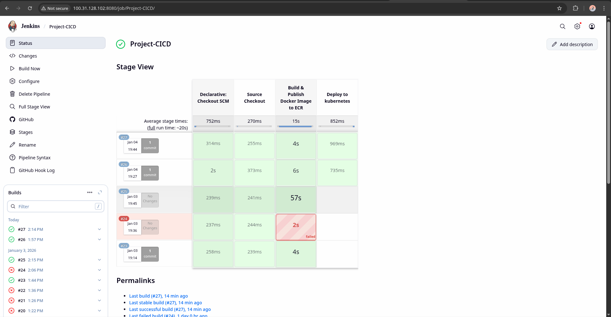
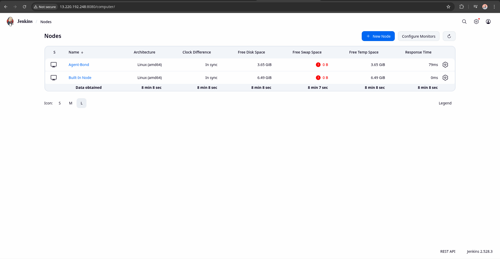
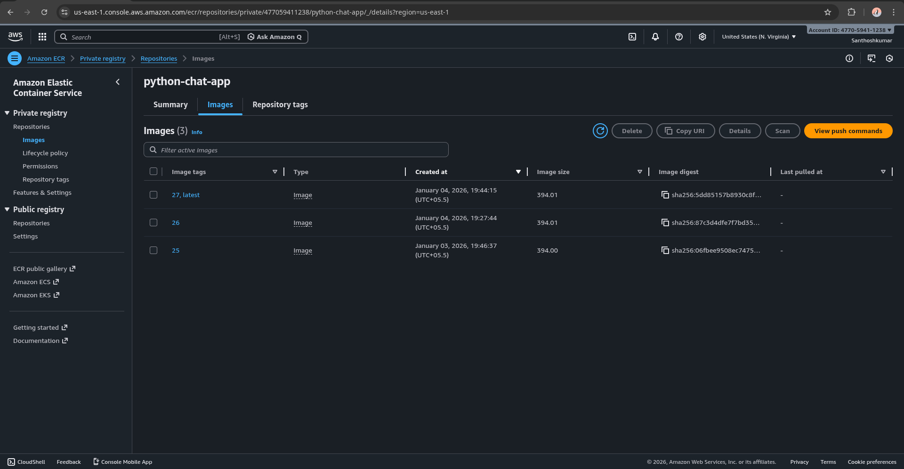
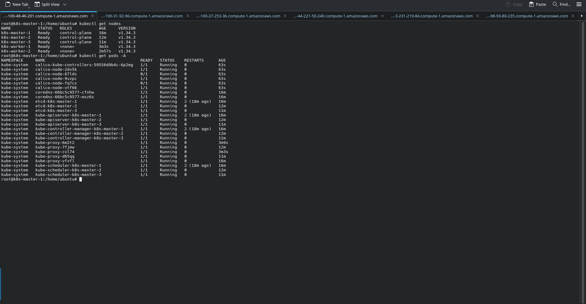
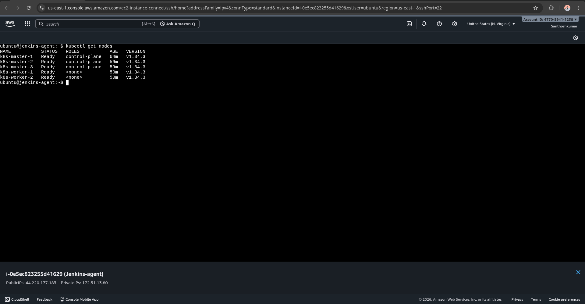

# Redis Chat App Deployment

Real-time chat application deployed on a **high-availability Kubernetes cluster** using **Jenkins CI/CD**, **Docker**, and **AWS ECR (private registry)**.

This project intentionally uses **manual infrastructure setup (no EKS)** to understand how Kubernetes HA, container runtimes, networking (CNI), and CI/CD integration work in real-world conditions.

---

## Architecture & CI/CD Evidence

### CI/CD Pipeline Execution (Jenkins)



This shows a full Jenkins declarative pipeline with stages for:
- SCM checkout
- Docker image build
- Push to AWS ECR
- Deployment to Kubernetes

---

### Jenkins Agent Configuration



A dedicated Jenkins agent is used instead of running builds on the controller. This follows Jenkins best practices and avoids overloading the master node.

---

### Docker Images in AWS ECR (Private Registry)



Each successful pipeline run produces a uniquely tagged Docker image pushed to **AWS ECR (private)**. Tags map directly to Jenkins build numbers, ensuring traceability.

---

### Kubernetes Cluster Health & Networking



All control-plane and worker nodes are in `Ready` state after installing **Calico v3.30.3**. This confirms correct CNI installation and pod networking.

---

### Kubernetes Access from Jenkins Agent



The Jenkins agent is configured with a valid kubeconfig, allowing it to deploy workloads directly into the Kubernetes cluster.

---

## Overview

* **Application**: Python Flask + Socket.IO (real-time chat)
* **Redis**: Runs inside Kubernetes (Deployment + Service)
* **CI/CD**: Jenkins Master + Jenkins Agent (EC2)
* **Container Registry**: AWS ECR (private)
* **Kubernetes**: kubeadm-based HA cluster on EC2
* **Nodes**: 5 total (3 masters + 2 workers)
* **Container Runtime**: containerd
* **CNI**: Calico v3.30.3
* **Control Plane Load Balancer**: HAProxy

---

## Kubernetes Cluster Setup

### Cluster Topology

* 3 × Control-plane (master) nodes
* 2 × Worker nodes
* **Stacked etcd** (etcd runs on master nodes)
* HAProxy provides a **single kube-apiserver endpoint**

### High Availability (How It Actually Works)

* etcd requires **quorum** to operate
* With 3 masters, quorum = 2
* The cluster remains operational if **one master node fails**
* HAProxy forwards API traffic only to healthy control-plane nodes

This follows Kubernetes HA best practices and mirrors real production-style clusters.

---

## Container Runtime & Networking

* **Container Runtime**: `containerd`
* **Pod Networking**: Calico (CNI)

### Why Nodes Were `NotReady` After `kubeadm join`

After running `kubeadm init` / `kubeadm join`:

* containerd was running
* kubelet was running
* **Pod networking was NOT available**

Kubernetes **always requires a CNI plugin** to:

* Assign Pod IP addresses
* Enable Pod-to-Pod communication

Until a CNI plugin is installed, kubelet reports:

```
NetworkPluginNotReady
cni config uninitialized
```

Because of this, nodes stay in the `NotReady` state.

Once Calico is installed, networking is initialized and all nodes transition to `Ready`.

This behavior is **normal and expected** in kubeadm-based clusters.

---

## Kubernetes Initialization (Example)

```bash
kubeadm init \
  --control-plane-endpoint="<HAPROXY_IP>:6443" \
  --apiserver-cert-extra-sans=<HAPROXY_IP> \
  --pod-network-cidr=192.168.0.0/16 \
  --upload-certs
```

Configure kubeconfig:

```bash
mkdir -p $HOME/.kube
sudo cp /etc/kubernetes/admin.conf $HOME/.kube/config
sudo chown $(id -u):$(id -g) $HOME/.kube/config
```

Join remaining masters and workers using the `kubeadm join` commands generated during initialization.

---

## Install Calico (CNI)

Calico is installed using the official manifest (no operator):

```bash
kubectl apply -f https://raw.githubusercontent.com/projectcalico/calico/v3.30.3/manifests/calico.yaml
```

Verify:

```bash
kubectl get nodes
kubectl get pods -n kube-system
```

---

## Jenkins Setup

### Jenkins Architecture

* **Jenkins Master (Controller)**

  * Manages pipelines and credentials
  * Receives GitHub webhooks

* **Jenkins Agent (Build Node)**

  * Builds Docker images
  * Pushes images to AWS ECR
  * Executes `kubectl` commands

This separation keeps the controller lightweight and follows Jenkins best practices.

---

## Jenkins Credentials

Stored in Jenkins Credentials Manager:

* **AWS credentials** (for ECR push access)
* **kubeconfig** stored as a *Secret File*

The kubeconfig is copied manually from a Kubernetes master node and uploaded to Jenkins.

---

## AWS ECR Notes (Important)

* Jenkins **does NOT create ECR repositories**
* The repository must be created manually:

```bash
aws ecr create-repository --repository-name chat-app --region <REGION>
```

### Private Registry Authentication

* ECR authentication tokens expire every ~12 hours
* Kubernetes pulls images using a `docker-registry` secret
* This secret must be **manually refreshed** when the token expires

Example:

```bash
kubectl create secret docker-registry ecr-secret \
  --docker-server=<ACCOUNT_ID>.dkr.ecr.<REGION>.amazonaws.com \
  --docker-username=AWS \
  --docker-password=$(aws ecr get-login-password --region <REGION>) \
  --docker-email=user@example.com
```

---

## Application Deployment

* Redis deployed as **Deployment + Service**
* Chat app deployed as **Deployment + Service**
* Socket.IO enables real-time communication
* Redis acts as the message broker

Deploy:

```bash
kubectl apply -f k8s/
kubectl rollout status deployment/chat-app
kubectl get pods
```

---

## Troubleshooting

### `ImagePullBackOff`

**Cause**:

* Missing or expired ECR pull secret

**Fix**:

* Recreate `ecr-secret`
* Restart the affected deployment

